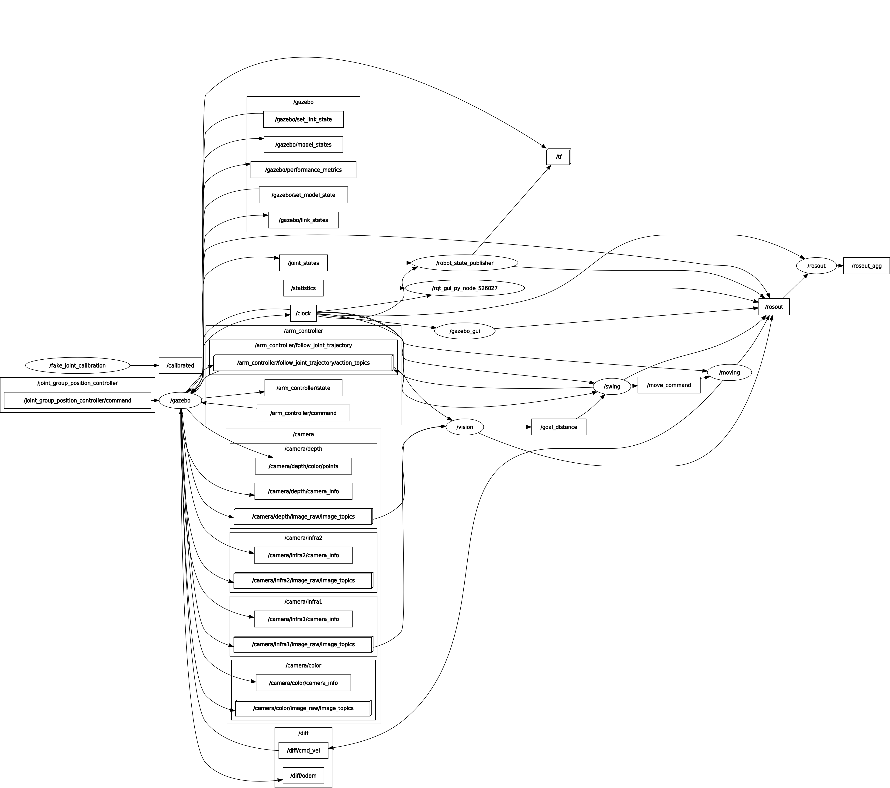

# Golfbot
This is a project for ME495 Cloud Simulation at Northwestern University
Author: Tianyu Li


## Proposal

The goal of this project is to use a mobile manipulator to hold a golf club and hit a golf ball to a specific target. The ball must leave the ground when travelling towards the goal, but must be on the ground when it is at the goal. As long as the ball is touching the ground when it is at the goal location, the attempt can be declared as a success trial. There could be obstacles (water, sand bunker, anything flat) between the robot and the goal. The goal location will be defined by the user, which can only be changed along the axis on which the ball will travel for now. The ball starting position will be fixed on a tee. A complete routine goes as follows:
1. The user will define a distance from the robot (potentially the obstacle)
2. A camera will determine the distance from the robot to the goal location
3. The robot will calculate the height for the swing in order to reach the distance
4. The robot perform the swing
5. The ball will be hit and fly towards the goal in the air
6. The ball will fall back to the ground and hit the goal


## ROS Graph



## Packages
```
sudo ./install_packages.sh
```

The script includes packages:
```
universal_robot
vision_opencv
realsense_gazebo_plugin
```

## Run Instructions


Basic run with default distance=5.0m
```
roslaunch golfbot main.launch
```

Basic run with option to enter user-defined distance (m)
```
roslaunch golfbot main.launch distance:=<distance>
```

When it is running, do the following to finish one hit
```
unpause Gazebo

rosservice call /eyeball  #Measure distance using depth

rosservice call /hit      #Perform the swing
```
